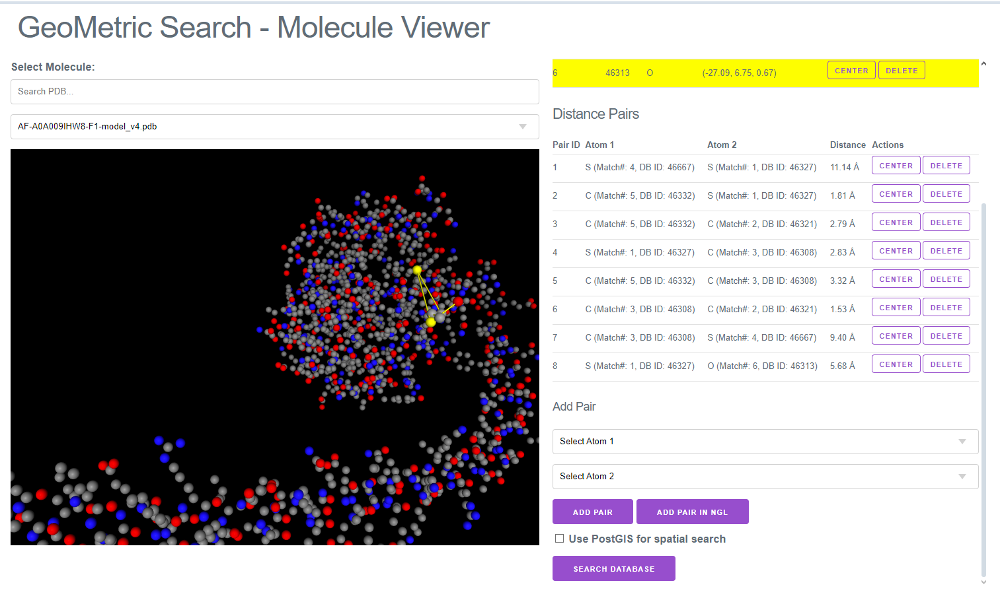
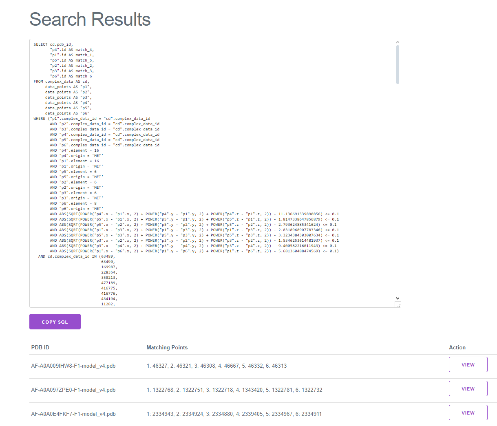
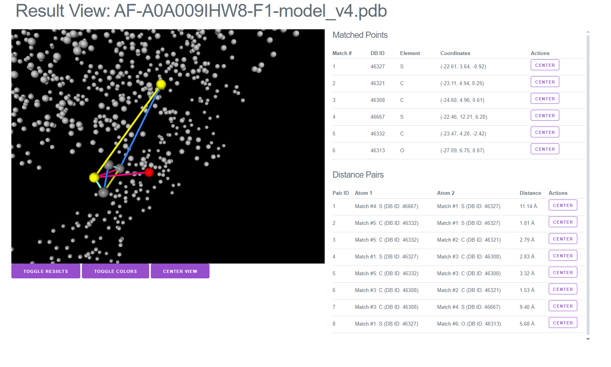

# ComplexMine


ComplexMine is a small web based tool to find similar patterns in protein complexes.
This application serves mainly as a small tech demo for database optimization technologies.

For a production ready feature-rich implementation users should refer to GeoMine on [https://proteins.plus].

This application uses PartitionCache to speed up database queries. For more information refer to [https://github.com/MPoppinga/PartitionCache]

## Usage

- Setting up database.env
- Download and import dataset
    - Download scripts for AlphaFold datasets are provided


### Setup

Requirements
- PostgreSQL database (or compatible)
  -  Alternatively: MySQL or MariaDB, however in our tests PostgreSQL showed better performance
- Redis (or compatible) as cache backend
- Python >= 3.9

### Running with Docker

The application can be run using Docker Compose:

1. The Docker setup uses the configuration file `database.env.example` which is already configured for the Docker environment.

2. Build and start all services:
```bash
docker compose up -d
```

3. View logs:
```bash
docker compose logs -f
```

4. Stop all services:
```bash
docker compose down
```

#### Docker Environment Variables

The Docker setup includes the following environment variables that control the behavior of the application:

- `DOWNLOAD_DATA`: When set to `true`, the container will download the AlphaFold human dataset if it doesn't already exist
- `IMPORT_DATA`: When set to `true`, the container will import the PDB files into the database if they haven't been imported yet

You can modify these variables in the `compose.yaml` file:

```yaml
environment:
  - DOWNLOAD_DATA=true  # Set to false to skip download
  - IMPORT_DATA=true    # Set to false to skip import
```

##### Starting Docker Compose
Compose will start:
1. The ComplexMine web application (accessible at http://localhost:5000)
2. PostgreSQL database
3. Redis cache server
4. PartitionCache Observer (pcache-observer) for monitoring and caching database queries


#### PartitionCache Observer

The Docker Compose setup includes the pcache-observer service, which monitors database queries and utilizes caching for improved performance. The pcache-observer is part of the PartitionCache module.

### Manually Download data

For this demo application we use AlphaFold2 Data, however all PDB-style data sources should work.

For more information on the datasets in the download scripts see [https://alphafold.ebi.ac.uk]

Run for example
> download_af_human.sh // (smaller dataset) or 
> download_af_swiss_prot.sh // (larger dataset)

run importer 
```
python importer.py --import_pdb --pdb_folder="data/af_db/"
```

### Start webui

> python app.py --cachetype=redis

visit [http://localhost:5000]

[Example query](http://127.0.0.1:5000/#%7B"pdbId"%3A"AF-A0A009IHW8-F1-model_v4.pdb"%2C"pickedAtoms"%3A%5B%7B"element"%3A16%2C"id"%3A46327%2C"origin"%3A"MET"%2C"type"%3A"SD"%2C"x"%3A-22.61%2C"y"%3A3.643%2C"z"%3A-0.917%2C"index"%3A1761%7D%2C%7B"element"%3A6%2C"id"%3A46321%2C"origin"%3A"MET"%2C"type"%3A"CG"%2C"x"%3A-23.107%2C"y"%3A4.942%2C"z"%3A0.25%2C"index"%3A1760%7D%2C%7B"element"%3A6%2C"id"%3A46308%2C"origin"%3A"MET"%2C"type"%3A"CB"%2C"x"%3A-24.598%2C"y"%3A4.957%2C"z"%3A0.613%2C"index"%3A1758%7D%2C%7B"element"%3A16%2C"id"%3A46667%2C"origin"%3A"MET"%2C"type"%3A"SD"%2C"x"%3A-22.457%2C"y"%3A12.21%2C"z"%3A6.197%2C"index"%3A1800%7D%2C%7B"element"%3A6%2C"id"%3A46332%2C"origin"%3A"MET"%2C"type"%3A"CE"%2C"x"%3A-23.467%2C"y"%3A4.196%2C"z"%3A-2.418%2C"index"%3A1762%7D%2C%7B"element"%3A8%2C"id"%3A46313%2C"origin"%3A"MET"%2C"type"%3A"O"%2C"x"%3A-27.095%2C"y"%3A6.749%2C"z"%3A0.669%2C"index"%3A1759%7D%5D%2C"distancePairs"%3A%5B%7B"atom1"%3A%7B"element"%3A16%2C"id"%3A46667%2C"origin"%3A"MET"%2C"type"%3A"SD"%2C"x"%3A-22.457%2C"y"%3A12.21%2C"z"%3A6.197%2C"index"%3A1800%7D%2C"atom2"%3A%7B"element"%3A16%2C"id"%3A46327%2C"origin"%3A"MET"%2C"type"%3A"SD"%2C"x"%3A-22.61%2C"y"%3A3.643%2C"z"%3A-0.917%2C"index"%3A1761%7D%2C"distance"%3A11.136691339890856%7D%2C%7B"atom1"%3A%7B"element"%3A6%2C"id"%3A46332%2C"origin"%3A"MET"%2C"type"%3A"CE"%2C"x"%3A-23.467%2C"y"%3A4.196%2C"z"%3A-2.418%2C"index"%3A1762%7D%2C"atom2"%3A%7B"element"%3A16%2C"id"%3A46327%2C"origin"%3A"MET"%2C"type"%3A"SD"%2C"x"%3A-22.61%2C"y"%3A3.643%2C"z"%3A-0.917%2C"index"%3A1761%7D%2C"distance"%3A1.8147338647856879%7D%2C%7B"atom1"%3A%7B"element"%3A6%2C"id"%3A46332%2C"origin"%3A"MET"%2C"type"%3A"CE"%2C"x"%3A-23.467%2C"y"%3A4.196%2C"z"%3A-2.418%2C"index"%3A1762%7D%2C"atom2"%3A%7B"element"%3A6%2C"id"%3A46321%2C"origin"%3A"MET"%2C"type"%3A"CG"%2C"x"%3A-23.107%2C"y"%3A4.942%2C"z"%3A0.25%2C"index"%3A1760%7D%2C"distance"%3A2.793624885341624%7D%2C%7B"atom1"%3A%7B"element"%3A16%2C"id"%3A46327%2C"origin"%3A"MET"%2C"type"%3A"SD"%2C"x"%3A-22.61%2C"y"%3A3.643%2C"z"%3A-0.917%2C"index"%3A1761%7D%2C"atom2"%3A%7B"element"%3A6%2C"id"%3A46308%2C"origin"%3A"MET"%2C"type"%3A"CB"%2C"x"%3A-24.598%2C"y"%3A4.957%2C"z"%3A0.613%2C"index"%3A1758%7D%2C"distance"%3A2.8318968907783346%7D%2C%7B"atom1"%3A%7B"element"%3A6%2C"id"%3A46332%2C"origin"%3A"MET"%2C"type"%3A"CE"%2C"x"%3A-23.467%2C"y"%3A4.196%2C"z"%3A-2.418%2C"index"%3A1762%7D%2C"atom2"%3A%7B"element"%3A6%2C"id"%3A46308%2C"origin"%3A"MET"%2C"type"%3A"CB"%2C"x"%3A-24.598%2C"y"%3A4.957%2C"z"%3A0.613%2C"index"%3A1758%7D%2C"distance"%3A3.3234384303007634%7D%2C%7B"atom1"%3A%7B"element"%3A6%2C"id"%3A46308%2C"origin"%3A"MET"%2C"type"%3A"CB"%2C"x"%3A-24.598%2C"y"%3A4.957%2C"z"%3A0.613%2C"index"%3A1758%7D%2C"atom2"%3A%7B"element"%3A6%2C"id"%3A46321%2C"origin"%3A"MET"%2C"type"%3A"CG"%2C"x"%3A-23.107%2C"y"%3A4.942%2C"z"%3A0.25%2C"index"%3A1760%7D%2C"distance"%3A1.5346253614481937%7D%2C%7B"atom1"%3A%7B"element"%3A6%2C"id"%3A46308%2C"origin"%3A"MET"%2C"type"%3A"CB"%2C"x"%3A-24.598%2C"y"%3A4.957%2C"z"%3A0.613%2C"index"%3A1758%7D%2C"atom2"%3A%7B"element"%3A16%2C"id"%3A46667%2C"origin"%3A"MET"%2C"type"%3A"SD"%2C"x"%3A-22.457%2C"y"%3A12.21%2C"z"%3A6.197%2C"index"%3A1800%7D%2C"distance"%3A9.400582216011943%7D%2C%7B"atom1"%3A%7B"element"%3A16%2C"id"%3A46327%2C"origin"%3A"MET"%2C"type"%3A"SD"%2C"x"%3A-22.61%2C"y"%3A3.643%2C"z"%3A-0.917%2C"index"%3A1761%7D%2C"atom2"%3A%7B"element"%3A8%2C"id"%3A46313%2C"origin"%3A"MET"%2C"type"%3A"O"%2C"x"%3A-27.095%2C"y"%3A6.749%2C"z"%3A0.669%2C"index"%3A1759%7D%2C"distance"%3A5.681360488474569%7D%5D%7D)


### Start PartitionCache Observer
(optional)
```
pcache-observer --db_backend=postgresql --db_env_file=database.env --cache_backend=redis  --partition_key="complex_data_id" --db-name=proteins  --long_running_query_timeout=300s
```


### Overview







Protein Strucutres: AlphaFold Data Copyright (2022) DeepMind Technologies Limited.


# License

This program is licensed under the GPLv3 license. See [LICENSE](LICENSE) for details.